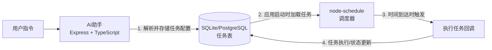

基于你的需求——**在本地部署的智能AI助手中，根据用户指令灵活配置定时任务**——我的结论很明确：

### 选择 `node-schedule`

`node-cron` 更适合简单、固定的周期性任务，而 `node-schedule` 在处理需要灵活创建、动态调整的复杂任务时优势更明显。下面通过详细对比来说明这个结论。

---

## 📊 node-cron vs node-schedule 核心功能对比

| 对比维度 | node-cron | node-schedule | 对你的AI助手项目的影响 |
| :--- | :--- | :--- | :--- |
| **核心灵活性** | 仅支持标准的Cron表达式。 | 支持Cron表达式、**JavaScript Date对象**、甚至**递归规则**（如`{hour: 14, minute: 30}`）。 | **关键**：用户说“下周三下午3点提醒我”，node-schedule可以直接用`new Date()`解析，而node-cron需要动态生成Cron表达式，逻辑更复杂。 |
| **动态调度** | 不支持动态修改。创建后任务规则不可变。 | **支持动态修改和取消**。可以随时取消一个任务，或用新规则重新调度。 | **关键**：用户可以随时说“取消我之前设置的提醒”或“把明早8点的任务改到9点”，node-schedule能完美支持。 |
| **复杂规则支持** | 适合周期性任务（如“每小时”、“每天凌晨2点”）。 | 除了周期性任务，还支持一次性任务、基于特定日期/时间的任务。 | 用户的需求是多样的：可能是“每天7点叫我起床”（周期），也可能是“一小时后提醒我开会”（一次性）。node-schedule都能轻松应对。 |
| **使用复杂度** | 简单，只需学习Cron语法。 | 中等，API更丰富，但同样直观。 | 简单和灵活永远是需要权衡的。node-schedule略微增加的复杂度，换来了巨大的灵活性，对于AI助手来说是值得的。 |
| **时区处理** | 支持，但有已知的**内存泄漏问题**。 | 基于本地时区，逻辑更直观。 | 对于本地部署的助手，使用系统时区通常是最简单的。 |
| **持久化** | **不支持**。应用重启后所有任务都会丢失。 | **不支持**。应用重启后所有任务都会丢失。 | ⚠️ **这是一个共同的重要限制**。需要你通过数据库（如SQLite）来实现任务的持久化存储和恢复。 |
| **资源消耗** | 非常轻量。 | 稍高，但在可接受范围内。 | 对于现代服务器而言，差异可以忽略不计。 |

---

## 🎯 为什么 `node-schedule` 更符合你的AI助手需求？

你的核心需求是：**“根据用户指令灵活配置定时任务”**。用户与AI的对话是自然语言，难以预测，可能产生各种调度需求。

1.  **“灵活配置”是核心优势**：`node-schedule` 的 API 就是为了灵活性而设计的。当用户的指令是“在每个月的最后一个工作日做报表”时，`node-schedule` 允许你编写自定义逻辑来判断“最后一个工作日”，而 `node-cron` 仅凭表达式很难优雅地实现这种需求。

2.  **动态管理任务的能力**：在AI助手的生命周期中，任务应该是可以被动态创建、取消和修改的。`node-schedule` 的 `cancel()` 和 `reschedule()` 方法让这一切变得非常直接，这正是你的智能助手需要具备的交互能力。

3.  **更自然的编程模型**：你可以直接使用 `new Date()` 或一个对象 `{hour: 14, minute: 30, dayOfWeek: 1}` 来定义规则，这比在代码中拼接Cron表达式更符合编程直觉，出错率也更低。

---

## 🏗️ 构建持久化的智能调度系统：架构建议

如前所述，`node-cron` 和 `node-schedule` 都是**内存级**的调度工具，它们本身不提供持久化功能。为了让你的AI助手在重启后还能记住所有任务，你需要构建一个**存储层**。推荐的架构如下：

### 核心实现步骤：

1.  **存储任务配置**：在数据库中创建一个 `scheduled_tasks` 表，包含以下关键字段：
    -   `id`：任务唯一标识。
    -   `rule`：存储任务的调度规则。对于 `node-schedule`，可以存储一个字符串（如 `'0 9 * * *'`）或一个JSON对象（如 `{"hour": 14, "minute": 30}`）。
    -   `action`：存储任务执行的具体内容，比如要调用的API、要执行的指令或要回复的消息。
    -   `status`：`'active'` 或 `'cancelled'`。

2.  **启动时恢复任务**：在你的 `Express` 应用启动时，从数据库中查询所有 `status` 为 `'active'` 的任务，然后遍历并用 `node-schedule` 的 `scheduleJob()` 方法将其重新加载到内存中。这一步非常关键。

3.  **动态管理任务**：
    -   **创建**：当用户下达指令时，先解析任务配置存入数据库，然后立即调用 `scheduleJob()` 激活它。
    -   **取消/修改**：更新数据库中对应的任务状态，然后调用 `myScheduledJob.cancel()` 来停止内存中的任务。

### 补充：更强大的方案

如果你的系统未来变得更加复杂，例如需要处理任务失败后的重试、复杂的优先级队列，或者需要在多进程/多服务器环境下运行，那么可以考虑使用 **`Bull`** 或 **`Agenda`** 这类专业的任务队列库。它们内置了持久化、重试和分布式支持，但对于你目前的场景来说，`node-schedule` + 数据库的方案是更简洁、直接的选择。

### 总结
选择 **`node-schedule`** 是为了其**无可比拟的灵活性**，能够完美匹配AI助手动态、多变的调度需求。再结合一个**持久化存储方案**，你就能构建出一个既灵活又可靠的智能任务调度系统。